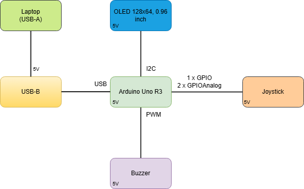
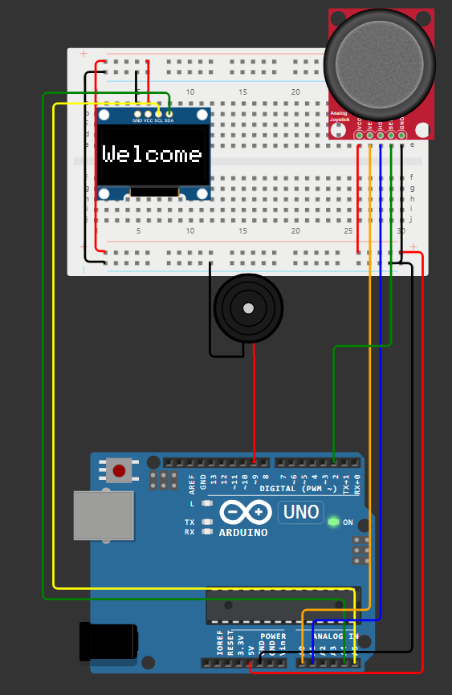
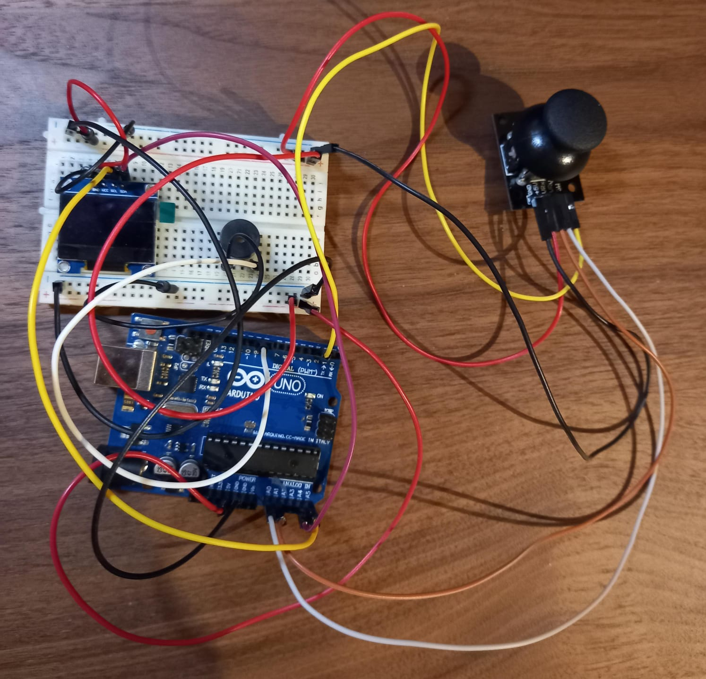
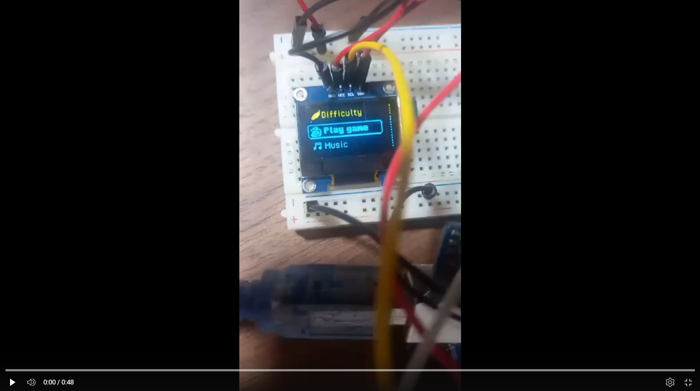

# Snake

## Introduction
**The Snake game** is a classic arcade-style game where players control a snake that grows longer as it consumes food. The objective is to navigate the snake around the playing field, avoiding collisions with walls or its own tail. With each piece of food eaten, the game becomes progressively more challenging as the snake grows longer.

## General Description

### Component Description
**1. Arduino Uno R3:**
- The central microcontroller of the project that manages the system's logic. It reads signals from the joystick, controls the buzzer, and updates the OLED display. Additionally, it executes commands based on user inputs. 

**2. OLED Display (128x64, I2C):**
- This display serves as the system's visual interface. Communication with the Arduino is done via the I2C protocol using the SCL (A5) and SDA (A4) pins.

**3. Joystick:**
- The joystick is used to control the direction of movement in the Snake game. It has two analog axes (vertical on A0 and horizontal on A1) and a button (SEL) on pin 2.

**4. Buzzer:**
- Connected to pin 9 of the Arduino, the buzzer emits sounds or tones in response to various events.

### Interaction Between Components
**1. Arduino and Joystick:**
- The joystick sends analog signals for the vertical axis (A0) and horizontal axis (A1) to the Arduino. Based on the joystick's movements, the Arduino updates the display and can trigger the buzzer if necessary. 

**2. Arduino and OLED Display:**
- The Arduino processes data from the joystick and uses the I2C protocol to update the OLED display. The snake's position and movement are displayed graphically, providing real-time feedback to the user.

**3. Arduino and Buzzer:**
- The Arduino controls the buzzer via pin 9, activating it to emit sounds. For example, the buzzer might signal when the snake eats food, hits a wall, or when the SEL button is pressed to pause or restart the game, providing an auditory response to key events in the game.

## Hardware Design

| Component               | Qty                |
|----------------------|--------------------|
|  **Arduino Uno R3**           | 1                  |
| **OLED Display (128x64, I2C)** | 1                |
| **Joystick**  | 1 |
| **Buzzer**                  | 1                  |
| **Wires**                 | Multiple           |

| Component                | Connected Pins           |
|--------------------------|--------------------------|
| **Arduino Uno R3**        | GND (2), 5V, A5 (SCL), A4 (SDA), A0 (VERT), A1 (HORZ), 2 (SEL), 9 (Buzzer) |
| **OLED Display (128x64, I2C)**| SCL (A5), SDA (A4), VCC, GND |
| **Joystick**              | VCC, GND, VERT (A0), HORZ (A1), SEL (Pin 2) |
| **Buzzer**                | Pin 9                    |

## Bill of Materials (BOM)

| Component          | Source                  | Datasheet                                |
|--------------------|-------------------------|------------------------------------------|
| Arduino Uno R3     | FMI UNIBUC | [Datasheet](https://docs.arduino.cc/resources/datasheets/A000066-datasheet.pdf) |
| OLED Display 128x64 | FMI UNIBUC  | [Datasheet](https://www.datasheethub.com/ssd1306-128x64-mono-0-96-inch-i2c-oled-display/) |
| Analog Joystick    | [Emag](https://www.emag.ro/afisaj-grafic-oled-128x64-0-96-inch-galben-albastru-3874784221572/pd/DGTRPXYBM/)      | [Datasheet](https://www.hwkitchen.cz/user/related_files/joystick-modul-s-tlacitkem-datasheet-pdf.pdf) |
| Buzzer             | FMI UNIBUC  | [Datasheet](https://components101.com/misc/buzzer-pinout-working-datasheet) |
| Half Breadboard         | FMI UNIBUC  | [Datasheet](https://www.farnell.com/datasheets/1734497.pdf) |

## Software Design
### Development Environment
- Environment Used: **PlatformIO**
- Development Board: **Arduino Uno R3**
- Libraries Used:
  - **Adafruit_SSD1306**: for graphical display handling on OLED.
  - **Wire**: for I2C communication between the microcontroller and OLED.

### Algorithms and Structures Implemented
**1.Main Menu:**
- **Navigation** between different states **(PLAY, MUSIC, DIFFICULTY)** using the joystick.
- **Game configuration** is done by moving and pressing the joystick.

**2.Snake Difficulty:** 
- Adjusting snake speed (EASY, MEDIUM, HARD) by modifying the global variable **snakeSpeed**.

**3.Gameplay:** 
- **Snake Movement:** Implemented as a list of coordinates representing each segment's position.
- **Collisions:** Detecting snake collisions with screen boundaries or its own body.
- **Food Generation:** Random positioning of food on the screen.

**4.Sound:** 
- **Activating/Deactivating sound** from the MUSIC menu using a buzzer connected to the microcontroller.

**5.Hardware Interactions:** 
- **Joystick** is used for movement, menu navigation, and selection.
- **Buzzer** provides sound feedback.

### Sources and Functions Implemented
**1. File: main.cpp**
- **Main Functions:**
  - **setup():** Initializes the OLED display, joystick, and menu.
  - **loop():** Controls the application's states (menu, gameplay, gameOver, gameWin).
  - **joyInterrupt():** Handles joystick press using interrupts.
- **Global Variables:**
  - **snakeSpeed:** Controls the snake's speed.

**2. File: menu.cpp**
- **Functions:**
- **initMenu():** Displays the start screen.
- **menuLoop():** Handles navigation between menu states.

**3. File: game.cpp**
- **Main Functions:**
  - **moveSnake():** Updates the snake's position based on direction.
  - **checkCollision():** Detects collisions and ends the game in case of a collision.
  - **checkFoodCollision():** Checks if the snake ate food and generates new food.
  - **drawGame():** Draws the game on the display (snake, food).

**4. File: constants.h**  
- Defines hardware pins (joystick, buzzer, I2C).
- Sets up the OLED screen's size and other hardware parameters.

## Results 

## Conclusions
### Concepts learned during laboratories and applied to the project:
**1.PWM:** 
- PWM was used to control the buzzer, enabling the generation of different tones by varying the frequency

**2.ADC:**
- ADC was utilized to read joystick inputs, converting analog signals from the joystick's vertical and horizontal axes into digital values. These values were then used to navigate the menu system and control game mechanics.

**3.Interrupt:**
- Interrupts were employed to detect joystick button presses. This ensured quick and efficient response times by triggering specific actions, like starting the game

**4.I2C:**
- I2C communication was used to interface with the OLED display.

## Resources
### Hardware resources:
[Buzzer](https://projecthub.arduino.cc/SURYATEJA/use-a-buzzer-module-piezo-speaker-using-arduino-uno-cf4191) 
[Joystick](https://docs.arduino.cc/built-in-examples/usb/JoystickMouseControl/) 
[OLED Display](https://randomnerdtutorials.com/guide-for-oled-display-with-arduino/)

### Software resources: 
[LED Matrix Editor](https://xantorohara.github.io/led-matrix-editor/#) 
[Photopea](https://www.photopea.com/) 
[Arduino OLED Menu](https://github.com/upiir/arduino_oled_menu?tab=readme-ov-file) 
[image2cpp](https://javl.github.io/image2cpp/)
